# [Learn Git Branching](https://learngitbranching.js.org/)

## Git Commits

- A commit in a git repository records a snapshot of all the (tracked) files in your directory.

- Git wants to keep commits as lightweight as possible though, so it doesn't just blindly copy the entire directory every time you commit. It can (when possible) compress a commit as a set of changes, or a "delta", from one version of the repository to the next.

- Git also maintains a history of which commits were made when.

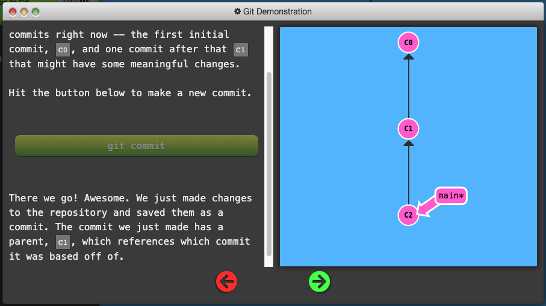

## Git Branches

- Simply pointers to a specific commit -- nothing more.

- Because there is no storage / memory overhead with making many branches, it's easier to logically divide up your work than have big beefy branches.

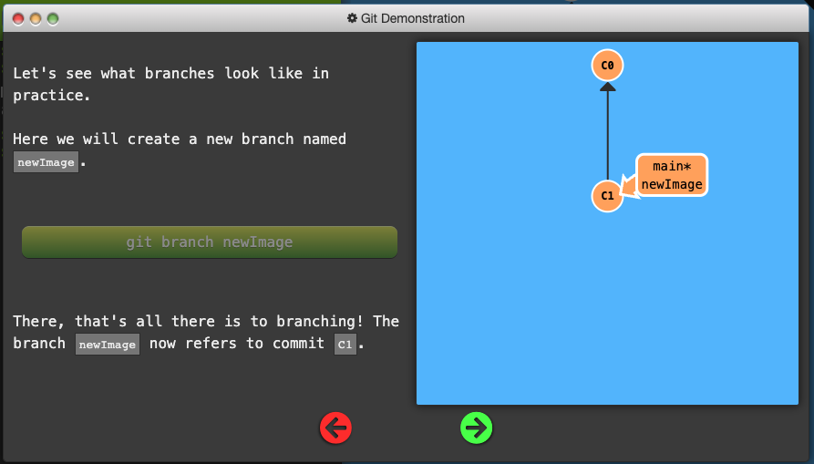

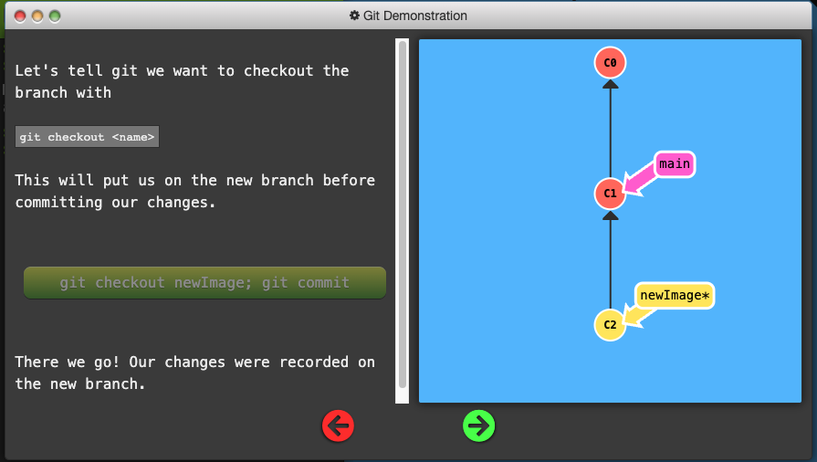

## Branches and Merging

- Merging in Git creates a special commit that has two unique parents.

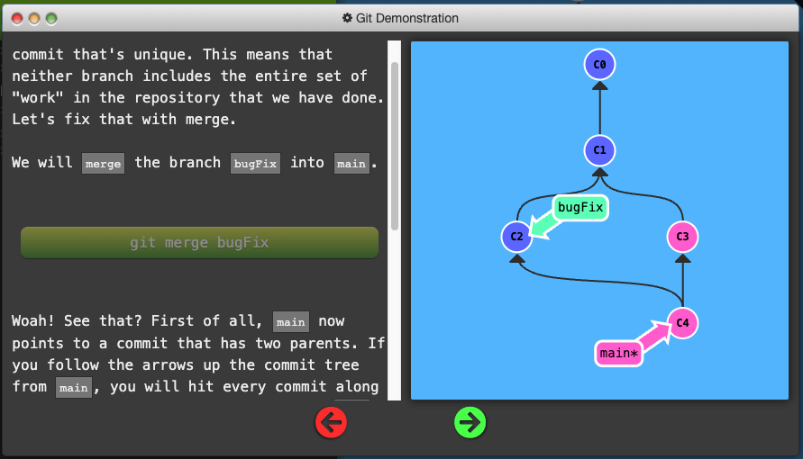

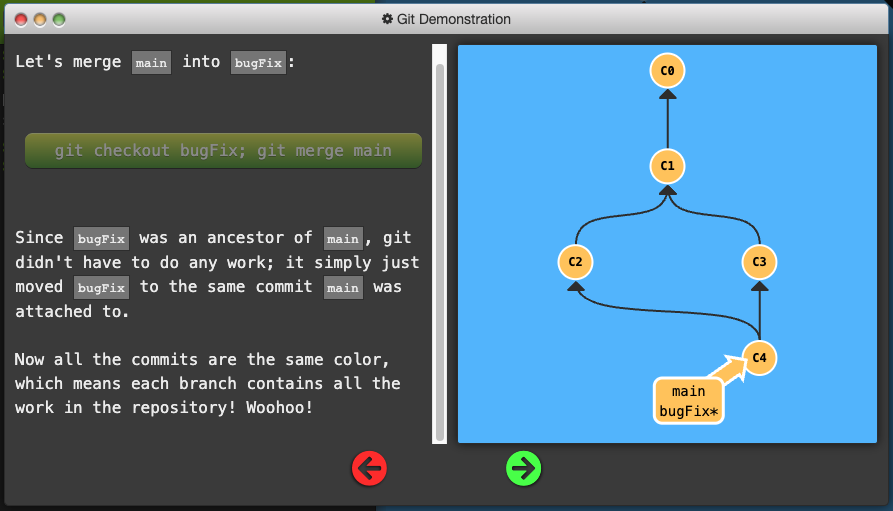

## Rebasing

- Combine work between branches via *rebasing*, which essentially takes a set of commits, "copies" them, and puts them somewhere else.

- The advantage is that it can be used to make a nice linear sequence of commits.

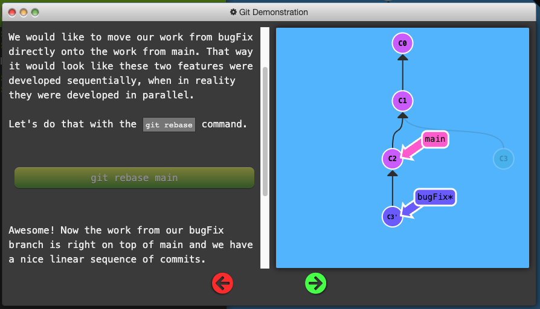

## HEAD

- HEAD is the symbolic name for the currently checkout out commit (essentially what commit you're working on top of)

- HEAD always points to the most recent commit which is reflected in the working tree. Most git commands which make changes to the working tree will start by changing HEAD

- Normally HEAD points to a branch name. When you commit, the status of this branch is altered and this change is visible through HEAD.

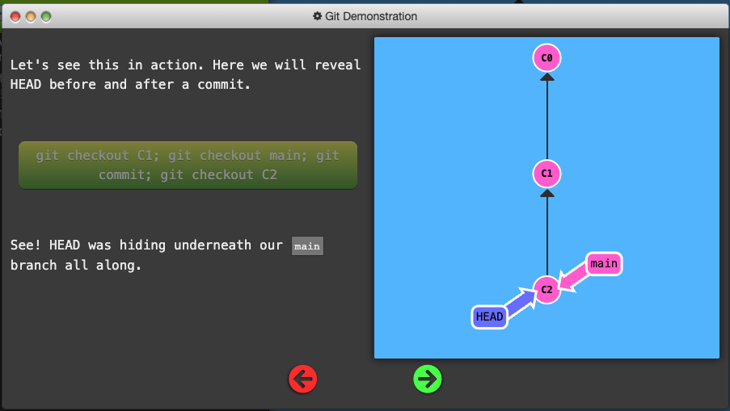

- Detaching HEAD just means attaching it to a commit instead of a branch.

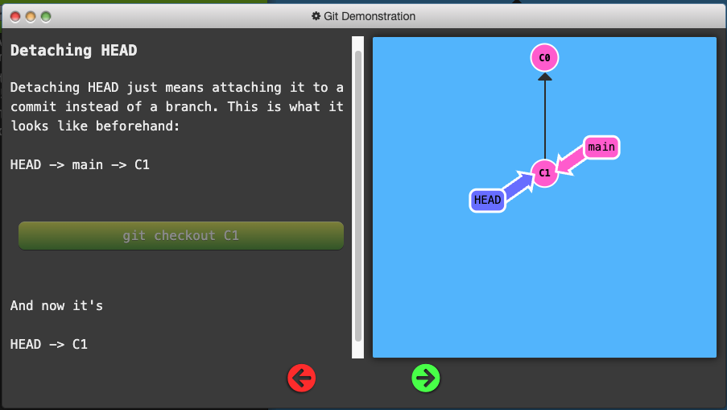

## Relative Refs

- Use `git log` to see hashes.

- Git only requires you to specify enough characters of the hash until it uniquely identifies the commit.

- With relative regs, you can start somewhere memorable and work from there.

- Two simple Relative commits:
  1. Moving upwards one commit at a time with `^`
  2. Moving upwards a number of times with `~<num>`

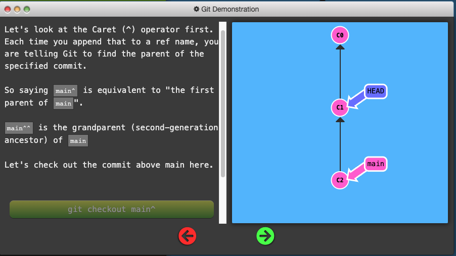

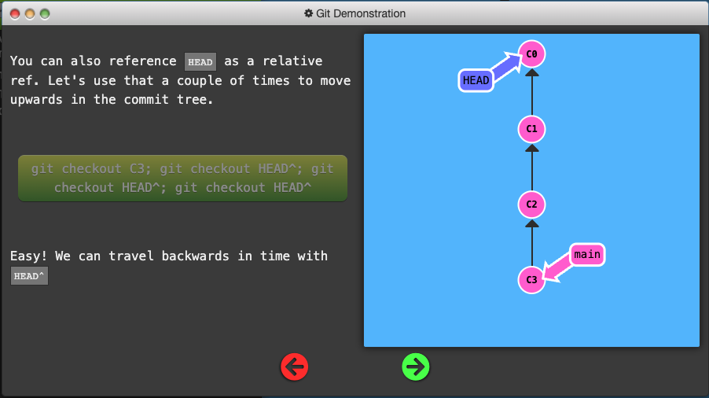

- The tilde operator (optionally) takes in a trailing number that specifies the number of parents you would like to ascend.

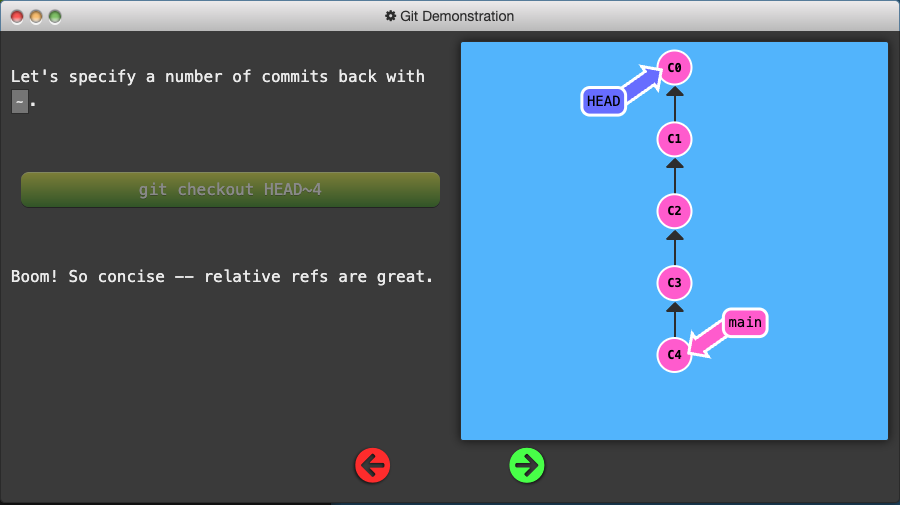

## Branch Forcing

- One of the most common ways to use relative refs is to move branches around. You can directly reassign a branch to a commit with the `-f` option which moves (by force) the branch.

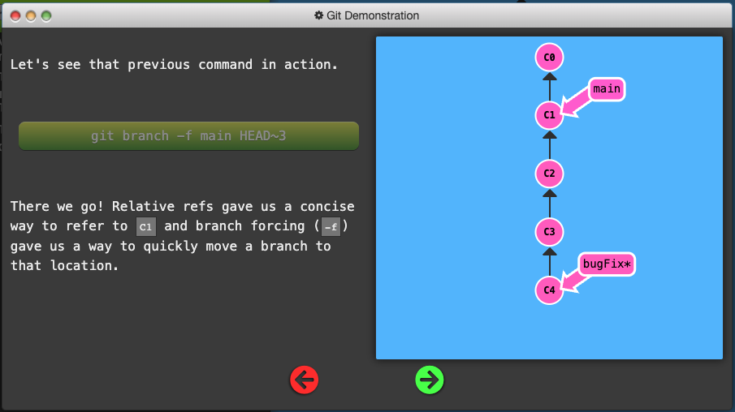

## Reversing Changes in Git

- low-level component: staging individual files or chunks

- high-level component: how the changes are actually reversed

Two primary ways to undo changes:

  1. `git reset`
  2. `git revert`

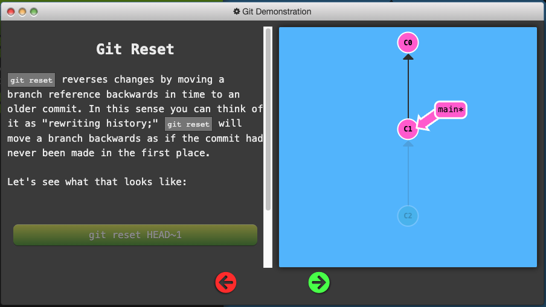

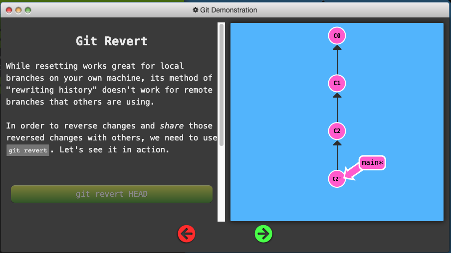

## Moving Work Around

### Git Cherry-pick

`git cherry-pick <Commit1> <Commit2> <...>`

- A very straightforward way of saying that you would like to copy a series of commits below your current location (`HEAD`). 

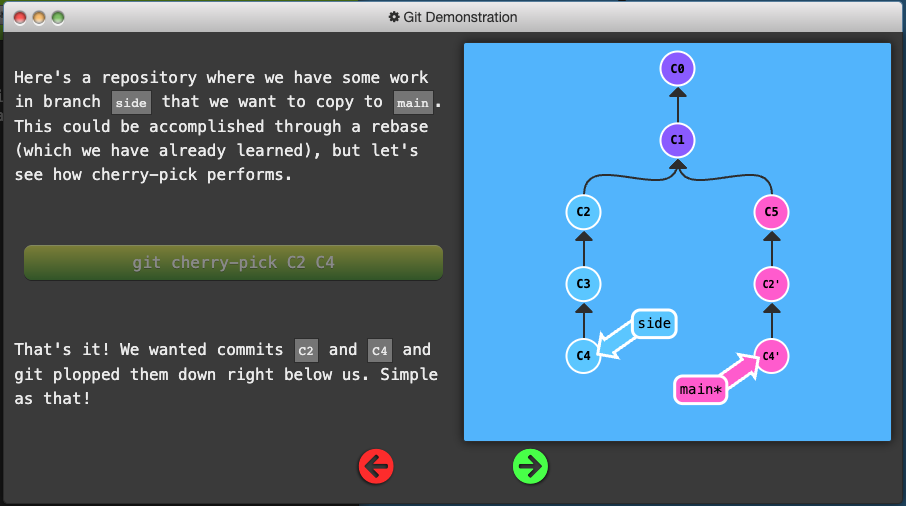

### Git Interactive Rebase

- Allows you to review a series of commits you're about to rebase

- Simply uses the `rebase` command with the `-i` option.

- If you include this option, git will open up a UI to show you which commits are about to be copied below the target of the rebase. It also shows their commit hashes.

- You must open up a file in a text editor like `vim`.

## Locally Stacked Commits
