# [Learn Git Branching](https://learngitbranching.js.org/)

**Git is a DevOps tool used for source code management. It is a free and open-source version control system used to handle small to very large projects efficiently. Git is used to tracking changes in the source code, enabling multiple developers to work together on non-linear development.**

## Git Commits

- A commit in a git repository records a snapshot of all the (tracked) files in your directory.

- Git wants to keep commits as lightweight as possible though, so it doesn't just blindly copy the entire directory every time you commit. It can (when possible) compress a commit as a set of changes, or a "delta", from one version of the repository to the next.

- Git also maintains a history of which commits were made when.

## Git Branches

- Simply pointers to a specific commit -- nothing more.

- Because there is no storage / memory overhead with making many branches, it's easier to logically divide up your work than have big beefy branches.

## Branches and Merging

- Merging in Git creates a special commit that has two unique parents.

## Rebasing

- Combine work between branches via *rebasing*, which essentially takes a set of commits, "copies" them, and puts them somewhere else.

- The advantage is that it can be used to make a nice linear sequence of commits.

## HEAD

- HEAD is the symbolic name for the currently checkout out commit (essentially what commit you're working on top of)

- HEAD always points to the most recent commit which is reflected in the working tree. Most git commands which make changes to the working tree will start by changing HEAD

- Normally HEAD points to a branch name. When you commit, the status of this branch is altered and this change is visible through HEAD.

- Detaching HEAD just means attaching it to a commit instead of a branch.

## Relative Refs

- Use `git log` to see hashes.

- Git only requires you to specify enough characters of the hash until it uniquely identifies the commit.

- With relative regs, you can start somewhere memorable and work from there.

- Two simple Relative commits:
  1. Moving upwards one commit at a time with `^`
  2. Moving upwards a number of times with `~<num>`

- The tilde operator (optionally) takes in a trailing number that specifies the number of parents you would like to ascend.

## Branch Forcing

- One of the most common ways to use relative refs is to move branches around. You can directly reassign a branch to a commit with the `-f` option which moves (by force) the branch.

## Reversing Changes in Git

- low-level component: staging individual files or chunks

- high-level component: how the changes are actually reversed

Two primary ways to undo changes:

  1. `git reset`
  2. `git revert`

## Moving Work Around

### Git Cherry-pick

`git cherry-pick <Commit1> <Commit2> <...>`

- A very straightforward way of saying that you would like to copy a series of commits below your current location (`HEAD`). 

### Git Interactive Rebase

- Allows you to review a series of commits you're about to rebase

- Simply uses the `rebase` command with the `-i` option.

- If you include this option, git will open up a UI to show you which commits are about to be copied below the target of the rebase. It also shows their commit hashes.

- You must open up a file in a text editor like `vim`.

## Locally Stacked Commits

### Grabbing Just 1 Commit:

- To tell git to copy only one of the commits over we can use the same commands:

  - `git rebase -i`
  - `git cherry-pick`

### Juggling Commits

- You have some changes (newImage) and another set of changes (caption) that are related, so they are stacked on top of each other in your repository (aka one after another).

- The tricky thing is that sometimes you need to make a small modification to an earlier commit. In this case, design wants us to change the dimensions of newImage slightly, even though that commit is way back in our history

The first command is git rebase -i HEAD~2

We will overcome this difficulty by doing the following:

- We will re-order the commits so the one we want to change is on top with `git rebase -i`
- We will `git commit --amend` to make the slight modification
- Then we will re-order the commits back to how they were previously with `git rebase -i`
- Finally, we will move main to this updated part of the tree to finish the level (via the method of your choosing)

- The only issue here is that there is a lot of reordering going on, which can introduce rebase conflicts.

- We can use `git cherry-pick` to avoid this

### Git Tags

- Branches are easy to move around and often refer to different commits as work is completed on them. Branches are easily mutated, often temporary, and always changing.

- Git tags (somewhat) permanently mark certain commits as "milestones" that you can then reference like a branch.

- They never move as more commits are created. You can't "check out" a tag and then complete work on that tag -- tags exist as anchors in the commit tree that designate certain spots.

### Git Describe

- Because tags serve as such great "anchors" in the codebase, git has a command to describe where you are relative to the closest "anchor" (aka tag). And that command is called `git describe`

Git describe takes the form of:

`git describe <ref>`

Where `<ref>` is anything git can resolve into a commit. If you don't specify a ref, git just uses where you're checked out right now (`HEAD`).

The output of the command looks like:

`<tag>_<numCommits>_g<hash>`

Where `tag` is the closest ancestor tag in history, `numCommits` is how many commits away that tag is, and `<hash>` is the hash of the commit being described.

### Specifying Parents

- Like the `~` modifier, the `^` modifier also accepts an optional number after it.

- Rather than specifying the number of generations to go back (what `~` takes), the modifier on `^` specifies which parent reference to follow from a merge commit. Remember that merge commits have multiple parents, so the path to choose is ambiguous.

- Git will normally follow the "first" parent upwards from a merge commit, but specifying a number with `^` changes this default behavior.

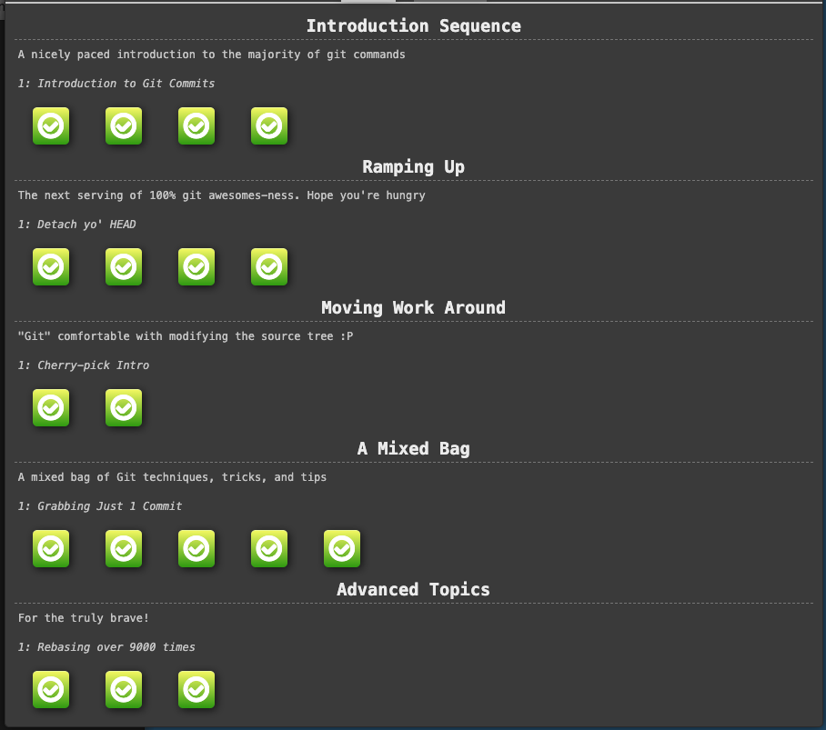

## Git Remotes

- Remote repositiories are copies of your repository on another computer. You can typically talk to this other computer through the Internet, which allows you to transfer commits back and forth.

- First and foremost, remotes serve as a great backup! Local git repositories have the ability to restore files to a previous state (as you know), but all that information is stored locally. By having copies of your git repository on other computers, you can lose all your local data and still pick up where you left off.

- Now that a copy of your project is hosted elsewhere, your friends can contribute to your project (or pull in your latest changes) very easily.

- `git clone` is the command you'll use to create local copies of remote repositories.

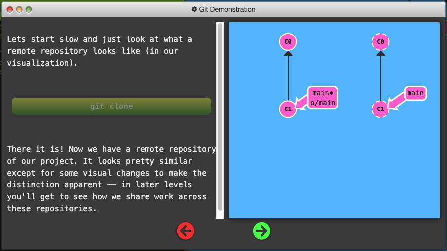

### Git Remote Branches

- The new branch that appeared in our local repository called o/main is a type of branch called a remote branch.

- Remote branches reflect the state of remote repositories (since you last talked to those remote repositories). They help you understand the difference between your local work and what work is public.

- Remote branches have the special property that when you check them out, you are put into detached HEAD mode. Git does this on purpose because you can't work on these branches directly; you have to work elsewhere and then share your work with the remote (after which your remote branches will be updated).

- Remote branches have a (required) naming convention -- they are displayed in the format of:

`<remote name>/<branch name>`

- If you look at a branch named `o/main`, the branch name is main and the name of the remote is `o`.

- Most developers actually name their main remote `origin`, not `o`. This is so common that git actually sets up your remote to be named `origin` when you `git clone` a repository.

- The full name of `origin` does not fit in our UI, so we use `o` as shorthand

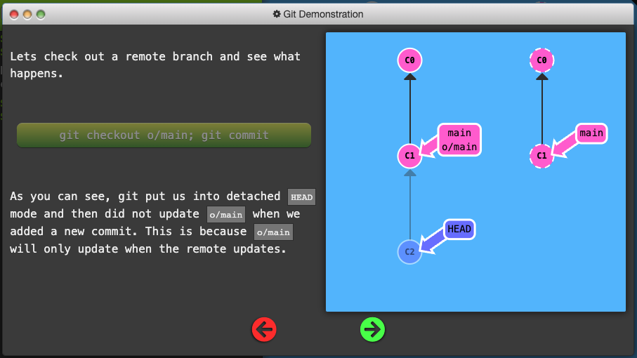

## Git Fetch

- To fetch data from a remote repository use the command `git fetch`

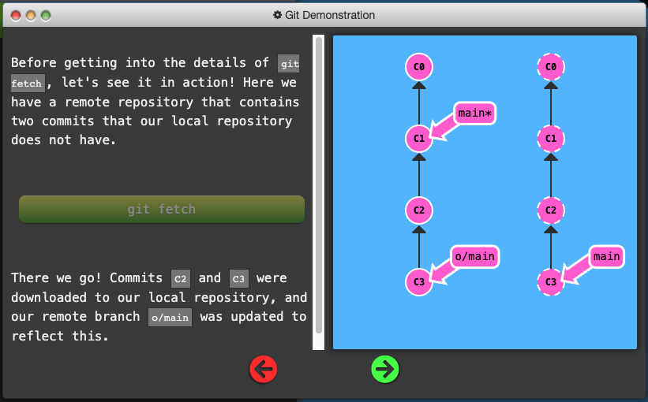

- `git fetch` does not change anything about your local state. It will not update your main branch or change anything about how your file system looks right now.

- **You can think of running `git fetch` as a download step.**

## Git Pull

- The workflow of fetching remote changes and then merging them is so common that git actually provides a command that does both at once! That command is `git pull`.

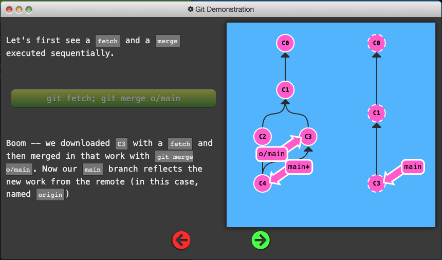

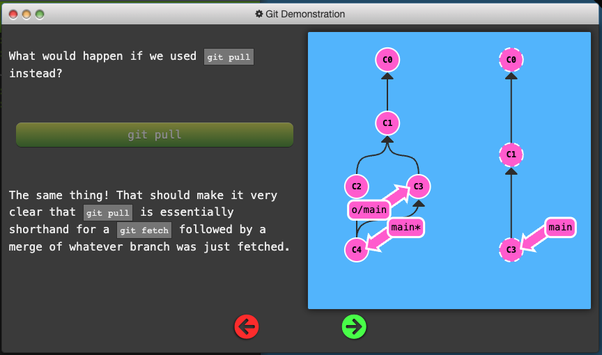

## Git Push

- `git push` is responsible for uploading your changes to a specified remote and updating that remote to incorporate your new commits.

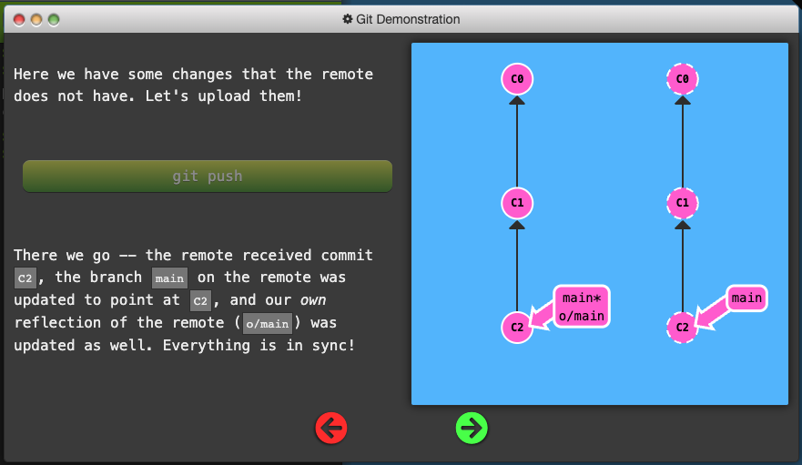

## Diverged Work

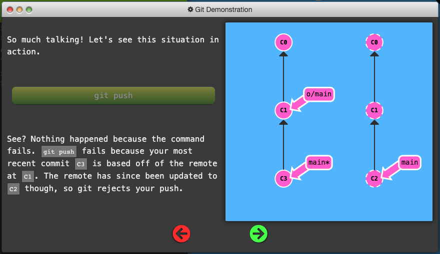

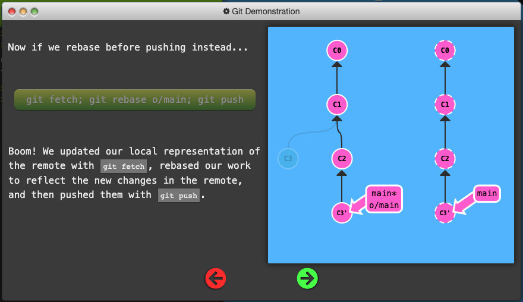

- Although `git merge` doesn't move your work (and instead just creates a merge commit), it's a way to tell git that you have incorporated all the changes from the remote. This is because the remote branch is now an ancestor of your own branch, meaning your commit reflects all commits in the remote branch.

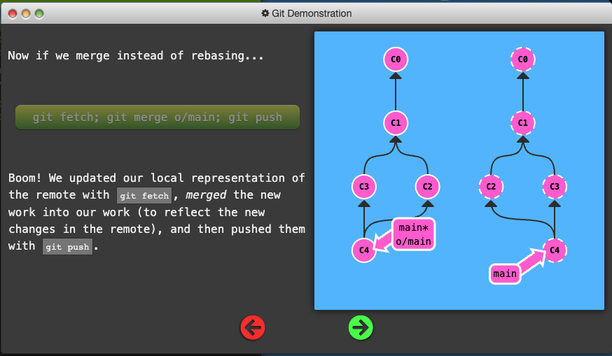

- `git pull` is just shorthand for a fetch and a merge. Conveniently enough, `git pull --rebase` is shorthand for a fetch and a rebase

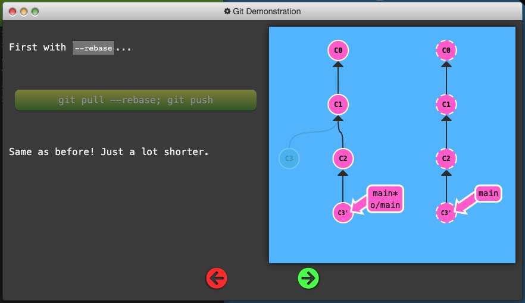

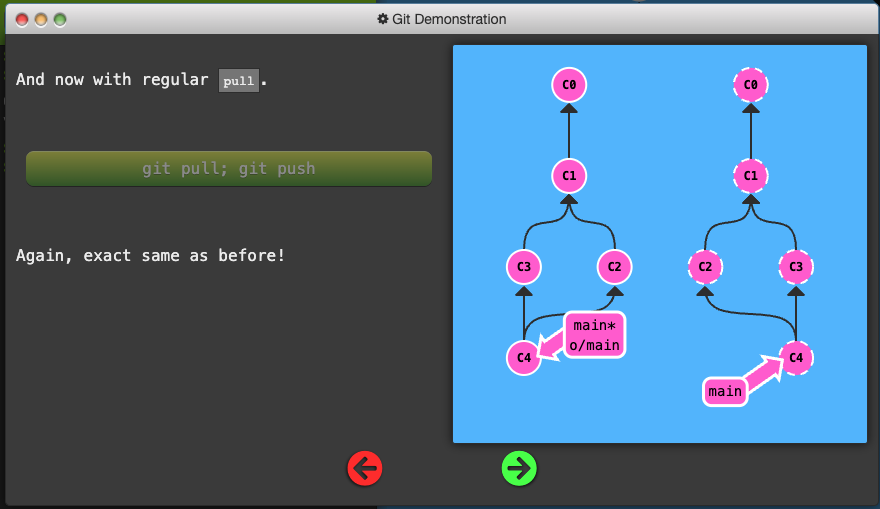

- Clone your repo
- Fake some teamwork (1 commit)
- Commit some work yourself (1 commit)
- Publish your work via rebasing

## Remote Rejected

If you work on a large collaborative team it's likely that main is locked and requires some Pull Request process to merge changes. If you commit directly to main locally and try pushing you will be greeted with a message similar to this:

`! [remote rejected] main -> main (TF402455: Pushes to this branch are not permitted; you must use a pull request to update this branch.)`

- The remote rejected the push of commits directly to main because of the policy on main requiring pull requests to instead be used.

- You meant to follow the process creating a branch then pushing that branch and doing a pull request, but you forgot and committed directly to main. Now you are stuck and cannot push your changes.

- Create another branch called feature and push that to the remote. Also reset your main back to be in sync with the remote otherwise you may have issues next time you do a pull and someone else's commit conflicts with yours.

## Merging Feature Branches

Some developers only push and pull when on the main branch -- that way main always stays updated to what is on the remote (o/main).

So for this workflow we combine two things:

- integrating feature branch work onto main, and
- pushing and pulling from the remote

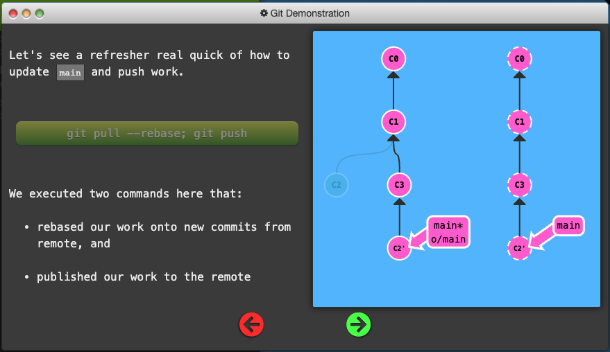

## Why Not Merge?

There's a lot of debate about the tradeoffs between merging and rebasing in the development community. Here are the general pros / cons of rebasing:

Pros:

- Rebasing makes your commit tree look very clean since everything is in a straight line

Cons:

- Rebasing modifies the (apparent) history of the commit tree.

For example, commit `C1` can be rebased past `C3`. It then appears that the work for `C1'` came after `C3` when in reality it was completed beforehand.

Some developers love to preserve history and thus prefer merging. Others prefer having a clean commit tree and prefer rebasing. It all comes down to preferences.

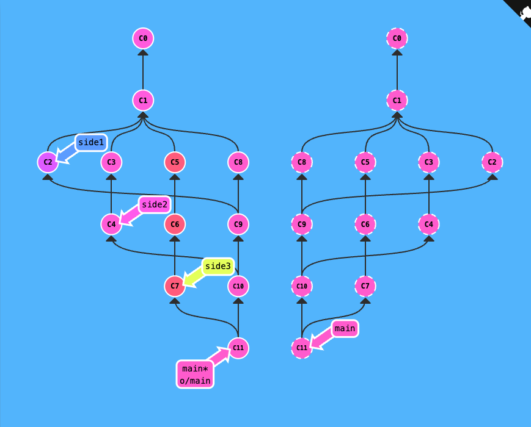

## Remote-Tracking branches

- During a pull operation, commits are downloaded onto `o/main` and then merged into the `main` branch. The implied target of the merge is determined from this connection.

- During a push operation, work from the `main` branch was pushed onto the remote's `main` branch (which was then represented by `o/main` locally). The destination of the push is determined from the connection between `main` and `o/main`

- this connection between main and o/main is explained simply by the "remote tracking" property of branches. The main branch is set to track o/main -- this means there is an implied merge target and implied push destination for the main branch.

- when you clone a repository with git, this property is actually set for you automatically

- During a clone, git creates a remote branch for every branch on the remote (aka branches like o/main). It then creates a local branch that tracks the currently active branch on the remote, which is main in most cases.

- Once git clone is complete, you only have one local branch (so you aren't overwhelmed) but you can see all the different branches on the remote

This also explains why you may see the following command output when cloning:

`local branch "main" set to track remote branch "o/main"`

- You can make any arbitrary branch track o/main, and if you do so, that branch will have the same implied push destination and merge target as main. This means you can run git push on a branch named totallyNotMain and have your work pushed to the main branch on the remote

There are two ways to set this property. The first is to checkout a new branch by using a remote branch as the specified ref. Running

`git checkout -b totallyNotMain o/main`

Creates a new branch named `totallyNotMain` and sets it to track `o/main`.

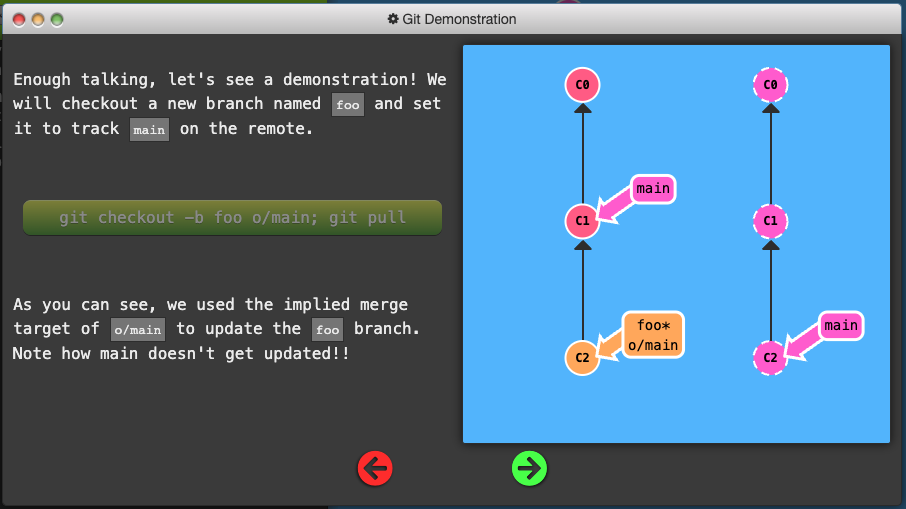

Another way to set remote tracking on a branch is to simply use the git branch -u option. Running

`git branch -u o/main foo`

will set the `foo` branch to track `o/main`. If foo is currently checked out you can even leave it off:

`git branch -u o/main`

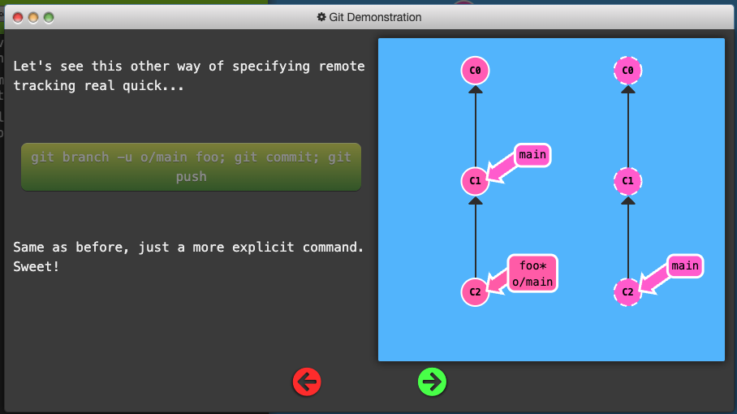