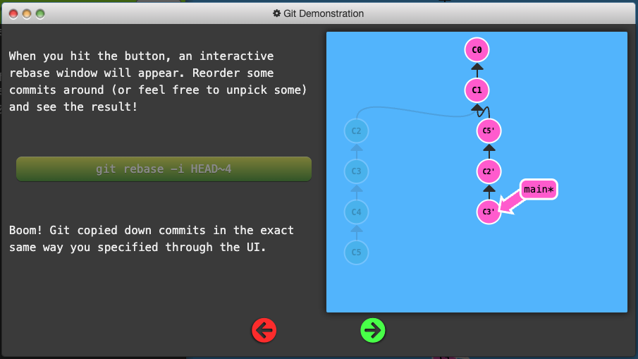
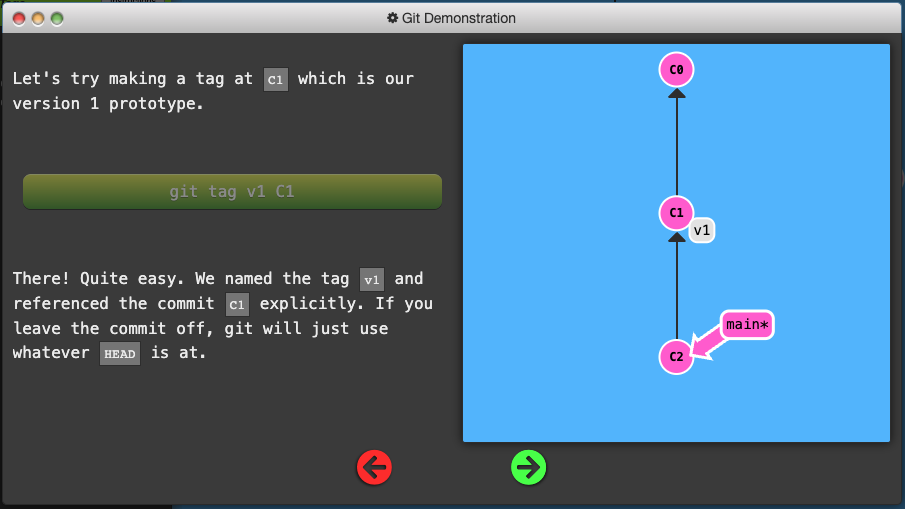
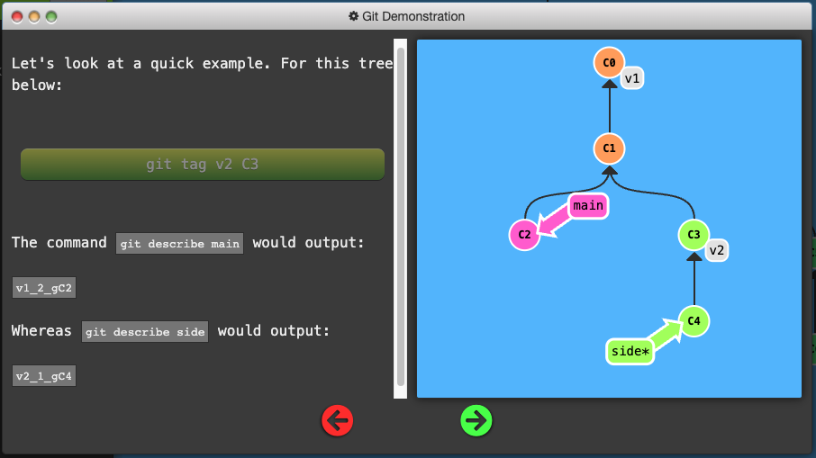
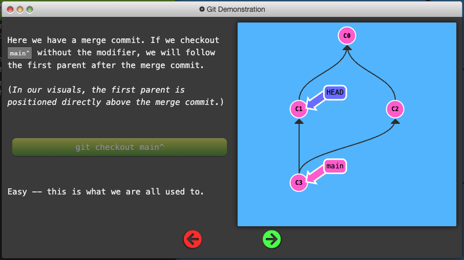
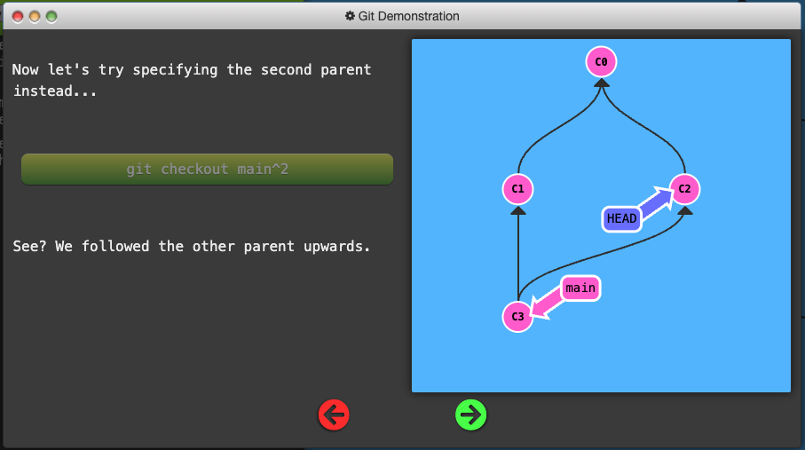
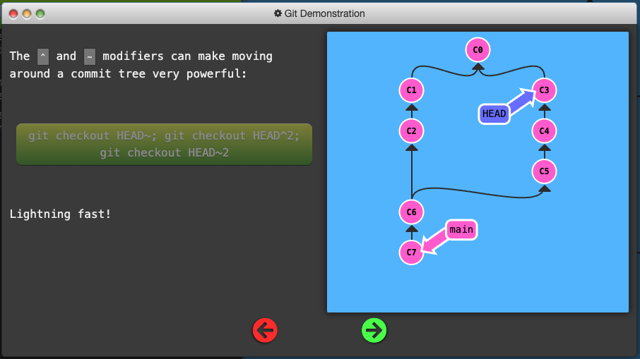
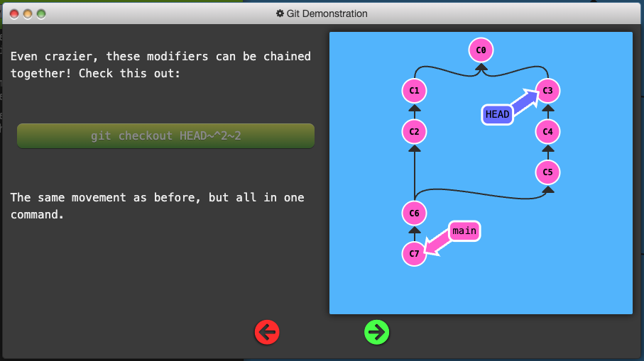

# [Learn Git Branching](https://learngitbranching.js.org/)

**Git is a DevOps tool used for source code management. It is a free and open-source version control system used to handle small to very large projects efficiently. Git is used to tracking changes in the source code, enabling multiple developers to work together on non-linear development.**

## Git Commits

- A commit in a git repository records a snapshot of all the (tracked) files in your directory.

- Git wants to keep commits as lightweight as possible though, so it doesn't just blindly copy the entire directory every time you commit. It can (when possible) compress a commit as a set of changes, or a "delta", from one version of the repository to the next.

- Git also maintains a history of which commits were made when.

## Git Branches

- Simply pointers to a specific commit -- nothing more.

- Because there is no storage / memory overhead with making many branches, it's easier to logically divide up your work than have big beefy branches.

## Branches and Merging

- Merging in Git creates a special commit that has two unique parents.

## Rebasing

- Combine work between branches via *rebasing*, which essentially takes a set of commits, "copies" them, and puts them somewhere else.

- The advantage is that it can be used to make a nice linear sequence of commits.

## HEAD

- HEAD is the symbolic name for the currently checkout out commit (essentially what commit you're working on top of)

- HEAD always points to the most recent commit which is reflected in the working tree. Most git commands which make changes to the working tree will start by changing HEAD

- Normally HEAD points to a branch name. When you commit, the status of this branch is altered and this change is visible through HEAD.

- Detaching HEAD just means attaching it to a commit instead of a branch.

## Relative Refs

- Use `git log` to see hashes.

- Git only requires you to specify enough characters of the hash until it uniquely identifies the commit.

- With relative regs, you can start somewhere memorable and work from there.

- Two simple Relative commits:
  1. Moving upwards one commit at a time with `^`
  2. Moving upwards a number of times with `~<num>`

- The tilde operator (optionally) takes in a trailing number that specifies the number of parents you would like to ascend.

## Branch Forcing

- One of the most common ways to use relative refs is to move branches around. You can directly reassign a branch to a commit with the `-f` option which moves (by force) the branch.

## Reversing Changes in Git

- low-level component: staging individual files or chunks

- high-level component: how the changes are actually reversed

Two primary ways to undo changes:

  1. `git reset`
  2. `git revert`

## Moving Work Around

### Git Cherry-pick

`git cherry-pick <Commit1> <Commit2> <...>`

- A very straightforward way of saying that you would like to copy a series of commits below your current location (`HEAD`). 

### Git Interactive Rebase

- Allows you to review a series of commits you're about to rebase

- Simply uses the `rebase` command with the `-i` option.

- If you include this option, git will open up a UI to show you which commits are about to be copied below the target of the rebase. It also shows their commit hashes.

- You must open up a file in a text editor like `vim`.

## Locally Stacked Commits

### Grabbing Just 1 Commit:

- To tell git to copy only one of the commits over we can use the same commands:

  - `git rebase -i`
  - `git cherry-pick`

### Juggling Commits

- You have some changes (newImage) and another set of changes (caption) that are related, so they are stacked on top of each other in your repository (aka one after another).

- The tricky thing is that sometimes you need to make a small modification to an earlier commit. In this case, design wants us to change the dimensions of newImage slightly, even though that commit is way back in our history

The first command is git rebase -i HEAD~2

We will overcome this difficulty by doing the following:

- We will re-order the commits so the one we want to change is on top with `git rebase -i`
- We will `git commit --amend` to make the slight modification
- Then we will re-order the commits back to how they were previously with `git rebase -i`
- Finally, we will move main to this updated part of the tree to finish the level (via the method of your choosing)

- The only issue here is that there is a lot of reordering going on, which can introduce rebase conflicts.

- We can use `git cherry-pick` to avoid this

### Git Tags

- Branches are easy to move around and often refer to different commits as work is completed on them. Branches are easily mutated, often temporary, and always changing.

- Git tags (somewhat) permanently mark certain commits as "milestones" that you can then reference like a branch.

- They never move as more commits are created. You can't "check out" a tag and then complete work on that tag -- tags exist as anchors in the commit tree that designate certain spots.

### Git Describe

- Because tags serve as such great "anchors" in the codebase, git has a command to describe where you are relative to the closest "anchor" (aka tag). And that command is called `git describe`

Git describe takes the form of:

`git describe <ref>`

Where `<ref>` is anything git can resolve into a commit. If you don't specify a ref, git just uses where you're checked out right now (`HEAD`).

The output of the command looks like:

`<tag>_<numCommits>_g<hash>`

Where `tag` is the closest ancestor tag in history, `numCommits` is how many commits away that tag is, and `<hash>` is the hash of the commit being described.

### Specifying Parents

- Like the `~` modifier, the `^` modifier also accepts an optional number after it.

- Rather than specifying the number of generations to go back (what `~` takes), the modifier on `^` specifies which parent reference to follow from a merge commit. Remember that merge commits have multiple parents, so the path to choose is ambiguous.

- Git will normally follow the "first" parent upwards from a merge commit, but specifying a number with `^` changes this default behavior.

