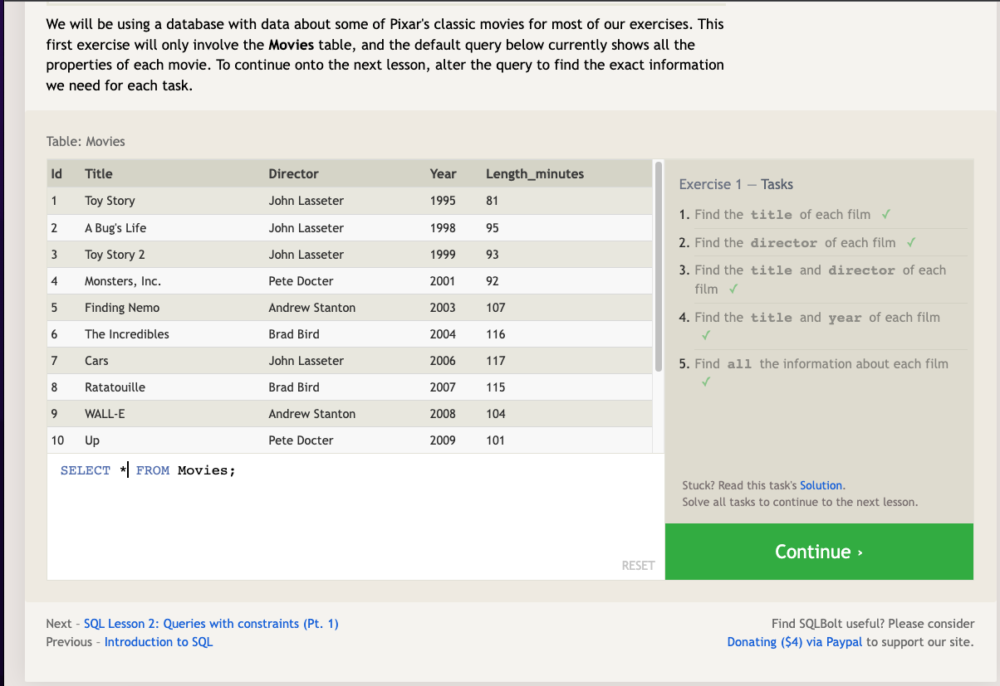
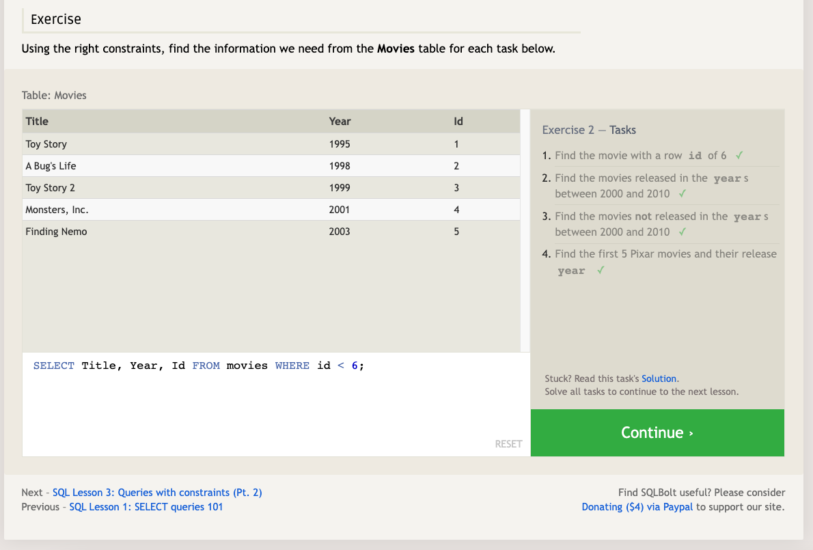

# SQL Practice

## [SQLBolt](https://sqlbolt.com/)

### Lesson 1

*To retrieve data from a SQL database, we need to write SELECT statements, which are often colloquially refered to as queries. A query in itself is just a statement which declares what data we are looking for, where to find it in the database, and optionally, how to transform it before it is returned.*

Select query for specific columns:

```SQL
SELECT column, another_column, …
FROM mytable;
```

- The result of this query will be a two-dimensional set of rows and columns, effectively a copy of the table, but only with the columns that we requested.

If we want to retrieve absolutely all the columns of data from a table, we can then use the asterisk (*) shorthand in place of listing all the column names individually:

```SQL
SELECT * 
FROM mytable;
```



### Lesson 2

*In order to filter certain results from being returned, we need to use a WHERE clause in the query. The clause is applied to each row of data by checking specific column values to determine whether it should be included in the results or not.*

Select query with constraints:

```SQL
SELECT column, another_column, …
FROM mytable
WHERE condition
    AND/OR another_condition
    AND/OR …;
```

- More complex clauses can be constructed by joining numerous AND or OR logical keywords:


- SQL doesn't require you to write the keywords all capitalized, but as a convention, it helps people distinguish SQL keywords from column and tables names, and makes the query easier to read.



### Lesson 3

- When writing WHERE clauses with columns containing text data, SQL supports a number of useful operators to do things like case-insensitive string comparison and wildcard pattern matching

- All strings must be quoted so that the query parser can distinguish words in the string from SQL keywords.


### Lesson 4

- SQL provides a convenient way to discard rows that have a duplicate column value by using the DISTINCT keyword.

Select query with unique results:

```SQL
SELECT DISTINCT column, another_column, …
FROM mytable
WHERE condition(s);
```

- SQL provides a way to sort your results by a given column in ascending or descending order using the ORDER BY clause.

- When an ORDER BY clause is specified, each row is sorted alpha-numerically based on the specified column's value. In some databases, you can also specify a collation to better sort data containing international text.

Select query with ordered results:

```SQL
SELECT column, another_column, …
FROM mytable
WHERE condition(s)
ORDER BY column ASC/DESC;
```

- The LIMIT clause will reduce the number of rows to return, and the optional OFFSET will specify where to begin counting the number rows from.

- LIMIT and OFFSET are applied relative to the other parts of a query: they are generally done last after the other clauses have been applied.

Select query with limited rows:

```SQL
SELECT column, another_column, …
FROM mytable
WHERE condition(s)
ORDER BY column ASC/DESC
LIMIT num_limit OFFSET num_offset;
```


### Lesson 5: Review


### Lesson 6

- Entity data is often broken down into pieces and stored across multiple orthogonal tables using a process known as *normalization*.

- Database normalization is useful because it minimizes duplicate data in any single table, and allows for data in the database to grow independently of each other. As a trade-off, queries get slightly more complex since they have to be able to find data from different parts of the database, and performance issues can arise when working with many large tables.

- Tables that share information about a single entity need to have a primary key that identifies that entity uniquely across the database. One common primary key type is an auto-incrementing integer (because they are space efficient), but it can also be a string, hashed value, so long as it is unique.

- Using the JOIN clause in a query, we can combine row data across two separate tables using this unique key.

- The INNER JOIN is a process that matches rows from the first table and the second table which have the same key (as defined by the ON constraint) to create a result row with the combined columns from both tables.

Select query with INNER JOIN on multiple tables:

```SQL
SELECT column, another_table_column, …
FROM mytable
INNER JOIN another_table 
    ON mytable.id = another_table.id
WHERE condition(s)
ORDER BY column, … ASC/DESC
LIMIT num_limit OFFSET num_offset;
```

- *You might see queries where the INNER JOIN is written simply as a JOIN. These two are equivalent, but we will continue to refer to these joins as inner-joins because they make the query easier to read once you start using other types of joins*


### Lesson 13

- In SQL, the database schema is what describes the structure of each table, and the datatypes that each column of the table can contain.

- When inserting data into a database, we need to use an INSERT statement, which declares which table to write into, the columns of data that we are filling, and one or more rows of data to insert. In general, each row of data you insert should contain values for every corresponding column in the table. You can insert multiple rows at a time by just listing them sequentially.

Insert statement with values for all columns:

```SQL
INSERT INTO mytable
VALUES (value_or_expr, another_value_or_expr, …),
       (value_or_expr_2, another_value_or_expr_2, …),
       …;
```

- In some cases, if you have incomplete data and the table contains columns that support default values, you can insert rows with only the columns of data you have by specifying them explicitly.

- In these cases, the number of values need to match the number of columns specified.

Insert statement with specific columns:

```SQL
INSERT INTO mytable
(column, another_column, …)
VALUES (value_or_expr, another_value_or_expr, …),
      (value_or_expr_2, another_value_or_expr_2, …),
      …;
```

- You can use mathematical and string expressions with the values that you are inserting. This can be useful to ensure that all data inserted is formatted a certain way.

Insert statement with expressions:

```SQL
INSERT INTO boxoffice
(movie_id, rating, sales_in_millions)
VALUES (1, 9.9, 283742034 / 1000000);
```


### Lesson 14

- A common task is to update existing data, which can be done using an UPDATE statement. Similar to the INSERT statement, you have to specify exactly which table, columns, and rows to update. In addition, the data you are updating has to match the data type of the columns in the table schema.

- The statement works by taking multiple column/value pairs, and applying those changes to each and every row that satisfies the constraint in the WHERE clause.

Update statement with values:

```SQL
UPDATE mytable
SET column = value_or_expr, 
    other_column = another_value_or_expr, 
    …
WHERE condition;
```

- **Always write the constraint first and test it in a SELECT query to make sure you are updating the right rows, and only then writing the column/value pairs to update.**


### Lesson 15

- When you need to delete data from a table in the database, you can use a DELETE statement, which describes the table to act on, and the rows of the table to delete through the WHERE clause.

Delete statement with condition:

```SQL
DELETE FROM mytable
WHERE condition;
```

- If you decide to leave out the WHERE constraint, then all rows are removed, which is a quick and easy way to clear out a table completely (if intentional).

- **It's recommended that you run the constraint in a SELECT query first to ensure that you are removing the right rows. Without a proper backup or test database, it is downright easy to irrevocably remove data, so always read your DELETE statements twice and execute once.**


### Lesson 16

- When you have new entities and relationships to store in your database, you can create a new database table using the CREATE TABLE statement.

- The structure of the new table is defined by its table schema, which defines a series of columns. Each column has a name, the type of data allowed in that column, an optional table constraint on values being inserted, and an optional default value.

Create table statement with optional table constraint and default value:

```SQL
CREATE TABLE IF NOT EXISTS mytable (
    column DataType TableConstraint DEFAULT default_value,
    another_column DataType TableConstraint DEFAULT default_value,
    …
);
```

Common Supported Data Types:


- Each column can have additional table constraints on it which limit what values can be inserted into that column.

A Few Common Constraints:


### Lesson 17


### Lesson 18


## [Learn SQL](https://cdn2.hubspot.net/hubfs/392937/Learn%20SQL.pdf?__hstc=158613477.01e6fbf0aa8dadc2cabb137b246a03be.1662315576791.1662315576791.1662315576791.1&__hssc=158613477.1.1662315576791&__hsfp=12106724&hsCtaTracking=5829d6cd-cd1b-47f8-92d1-0b3ba8bc9ce7%7Ca4ebeaea-cc21-4256-99ef-eeed3c103120)
